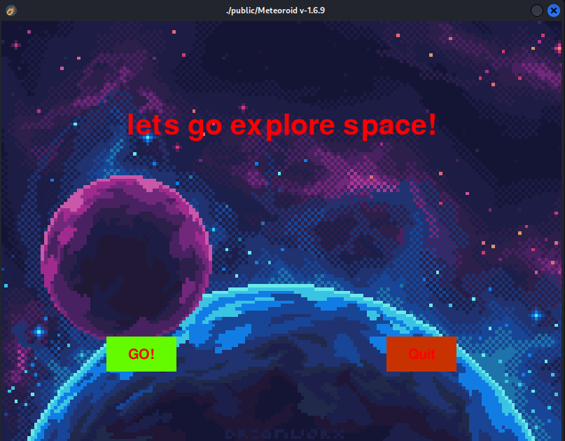
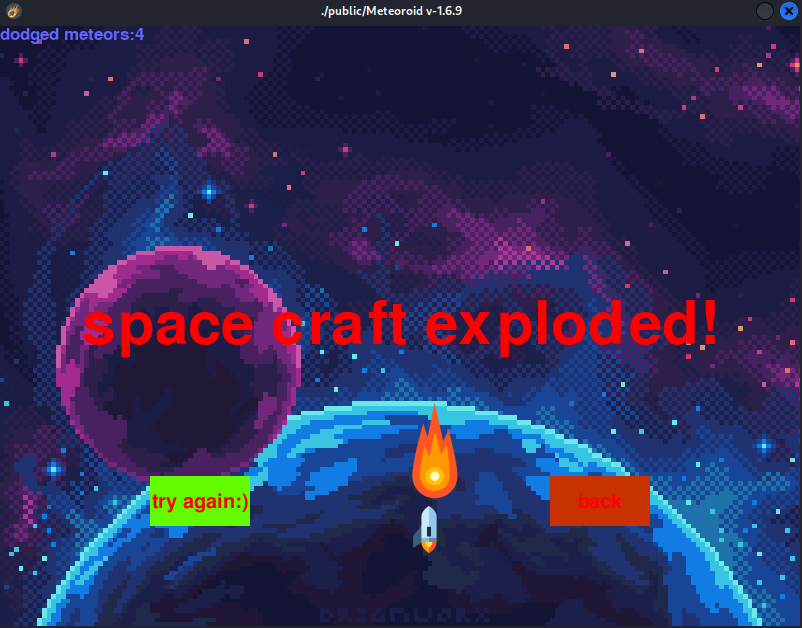
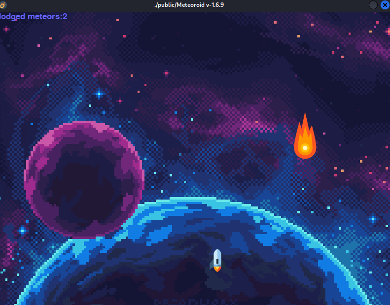

# meteroid-game
a 2D game made with pygame

## screen shots

</img>
</img>
</img>

# How to play?
for play the game you need to install python3 and pygame first:

```bash
pip install pygame
```

when it done you can simply run this command and start playing:
```bash
python3 meteoroid.py
```

# Linux
for runngin on linux you can download the linux version form release and normaly run executable file.

the windows and mac release soon...
